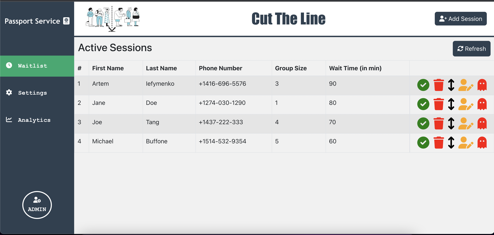
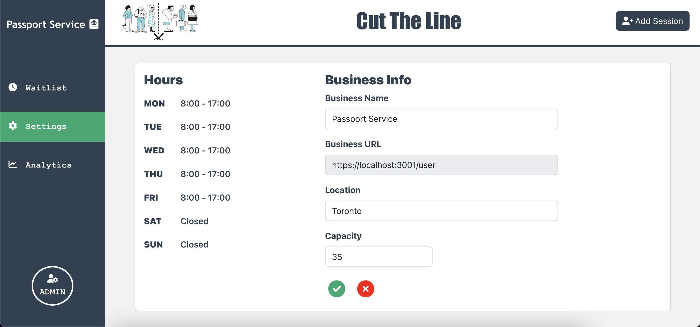
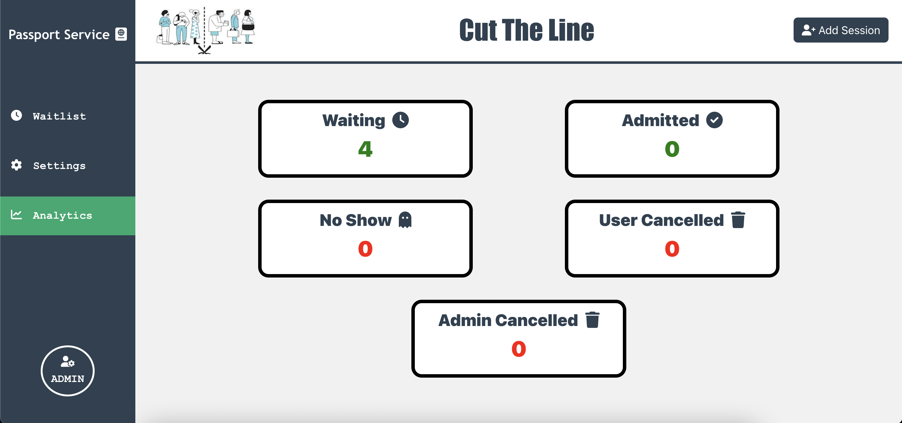
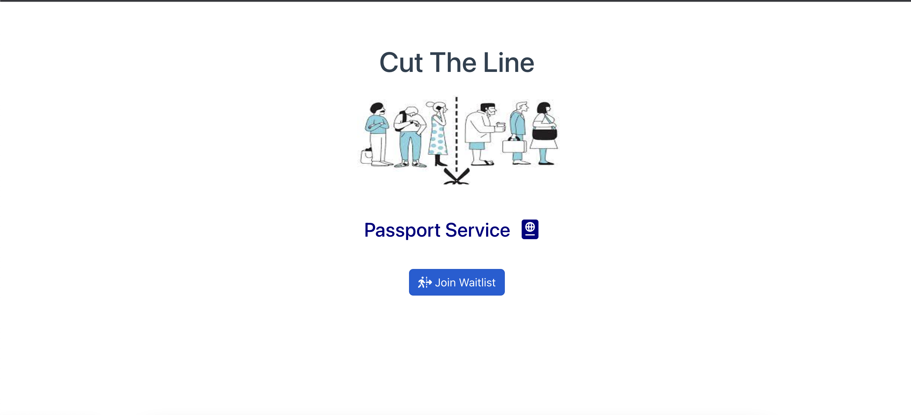
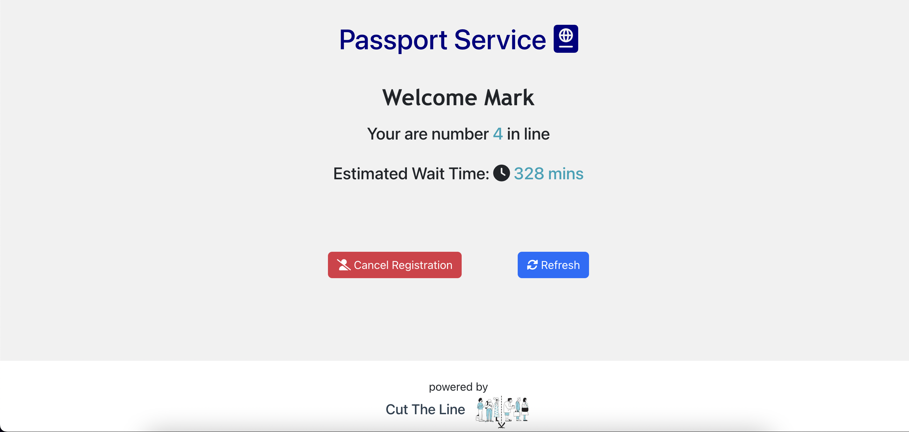

# Cut The Line

## Project Description

Created by Joe Tang, Artem Iefymenko and Michael Buffone.
Cut the line is a waitlist application that is used right now as a service for passport canada. It can be expanded to other government facilities.
The purpose is to stop being from having to wait hours at the office so they can wait from their homes until almost their time.

## Getting Started

- backend: npm start
- front-end: npm start
- Install dependencies: `npm i`
- Visit `http://localhost:3000/admin` to visit admin page
- Visit `http://localhost:3000/user` to visit user page
- For demo purpose we do not have a logged in user or admin

## Dependencies

#### Backend

- body-parser 1.20.0
- cors 2.8.5
- dotenv 16.0.1
- express 4.18.1
- express-pino-logger 7.0.0
- morgan 1.10.0
- pg 8.7.3
- twilio 3.80.0

#### Frontend

-
- font-awesome4.7.0
- axios 0.27.2
- bootstrap 5.2.0
- react18.2.0
- react-bootstrap 2.4.0
- react-dom 18.2.0
- react-phone-number-input3.2.6
- react-router-dom 6.3.0
- react-tooltip 4.2.21
- sass 1.54.0

## Screenshots

Admin Waitlist

Admin Settings

Admin Analytics

User Join

User Wait

